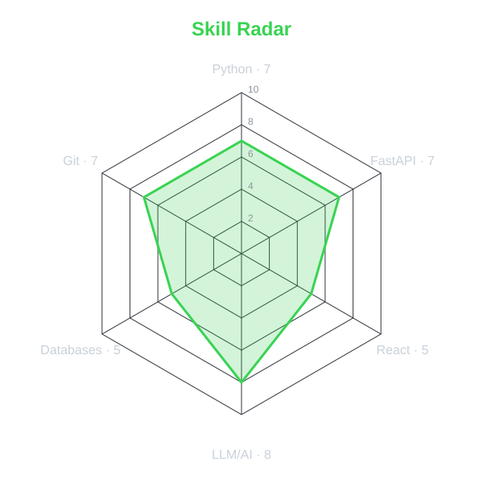
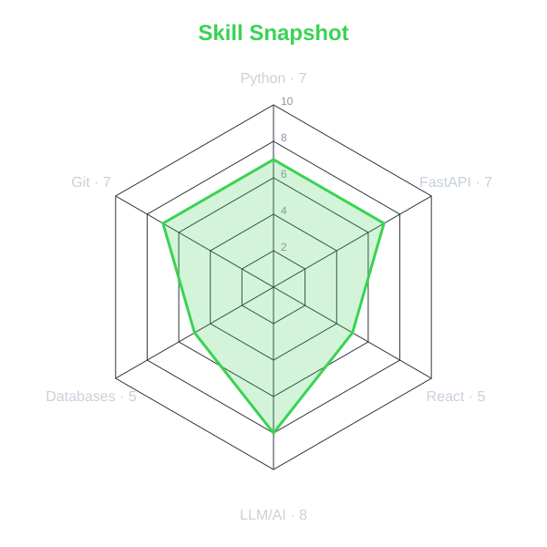

  

<!-- Upload the source photo as assets/profile.png, then run the Generate pixel portrait workflow. -->

  
   
   
  
  
  <!-- Portfolio badge template:  -->
  <!-- Codeforces badge template:  -->
  <!-- LeetCode badge template:  -->
   
   
  

## `~/` whoami

Hi, I'm Sahil Jain. I build things at the intersection of AI and e-commerce, currently focused on ShopSense India — an AI shopping copilot for Indian e-commerce with price comparison, bank offer intelligence, and visual/barcode search across Amazon, Flipkart, and Croma, with Razorpay checkout built in.

- Currently building [ShopSense India](https://github.com/Sahiljain6/Shopsense)
- Reach me on [LinkedIn](https://www.linkedin.com/in/sahiljaintech)

## `~/` toolbox

  

## `~/` skill radar

<!-- Placeholder values in scripts/generate_radar.py — update them when real self-assessments are available. -->
| Core skills | Skill snapshot |
| :---: | :---: |
|  |  |

## `~/` contribution calendar

  
   
  

## `~/` the numbers

## `~/` selected work

| project | live | stack |
| --- | --- | --- |
| ShopSense |  | FastAPI, LLMs, Razorpay, Vercel |
